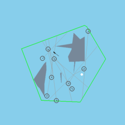
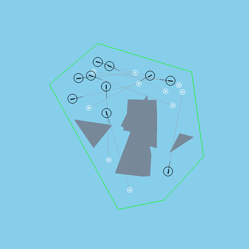

# BlueSky-Gym Air Traffic Control RL Competition

Design a reinforcement-learning agent that safely and efficiently guides
aircraft through a congested piece of airspace. You control aircraft heading
and speed; you must reach a goal waypoint while avoiding other traffic, static
obstacles (restricted areas / weather cells), and the edge of the sector.

| Single-agent (required) | Multi-agent (stretch) |
| --- | --- |
|  |  |

> The GIFs above show a **neutral** "fly straight to the goal" policy — it
> reaches the goal but flies through conflicts and restricted areas. Your job is
> to keep the goal-reaching while eliminating the safety violations.

New here? Start with the **[Getting Started guide](GETTING_STARTED.md)**.

---

## The task

Each episode places you in a randomly generated sector with:

- a **goal waypoint** to reach (captured within **5 km**),
- **static obstacles** — restricted areas and weather cells to stay out of,
- **other traffic** — scripted intruders (single-agent) or the other learning
  agents (multi-agent),
- the **sector boundary** you must stay inside.

Aircraft are Airbus A320s simulated by [BlueSky](https://github.com/TUDelft-CNS-ATM/bluesky).
You issue **heading and speed** commands; BlueSky handles the flight dynamics.
A **loss of separation (intrusion)** occurs whenever two aircraft come within
**5 NM** of each other. An episode ends for an aircraft when it reaches its goal,
and truncates for everyone once the simulated **3000 s** time budget is spent.

### Two environments

| | Single-agent (`CompetitionEnv-v0`) | Multi-agent (`CompetitionZooEnv`) |
| --- | --- | --- |
| API | Gymnasium | PettingZoo `ParallelEnv` |
| You control | 1 aircraft (`KL001`) | all 10 aircraft (shared or independent policies) |
| Other traffic | 10 scripted intruders on fixed routes | the other 9 agents (no scripted intruders) |
| Import | `gym.make("CompetitionEnv-v0")` | `from bluesky_zoo.competition_v0 import CompetitionZooEnv` |

The **single-agent environment is the main testing ground**
The **multi-agent environment is the main scoring goal** — see [Scoring](#how-you-are-scored).

---

## What you may change (your design surface)

You design your own MDP. Do it either by **subclassing** the environment and
overriding the three hooks below, or by **wrapping** it with standard
gymnasium / pettingzoo wrappers. All three hooks take an aircraft id, so the
same code works for both environments.

- **Observation — `_get_obs(ac_id)`** (rebuild the observation space if you
  change it, or use a wrapper). The shipped observation is a `Dict` composed
  from the building blocks in [`core/observations.py`](../../core/observations.py):
  waypoint drift/distance, own airspeed, per-intruder relative state, obstacles,
  and sector-boundary points. **Change it however you like** — different
  normalization, more/fewer intruders, relative vs. global frame, sort by
  distance / TCPA / DCPA, frame stacking — or **design your own from scratch**.
  How you *encode* it downstream is entirely up to you: MLP, recurrent, graph,
  attention — go crazy. **Horizontal information only** (no altitude).
- **Reward — `_get_reward(ac_id)`.** Full freedom to shape the reward. The
  reward does **not** affect the scored metrics or termination — it is purely
  your training signal.
- **Action mapping & rate — `_get_action(ac_id, action)`.** Map your policy's
  output to BlueSky heading/speed commands however you like, and tune
  `d_heading` (default 45°), `d_speed` (default ≈6.67 kt) and `action_frequency`
  (default 10 — how many 1-second sim steps pass between decisions).
  `action_frequency` is guaranteed **not** to change the scoring resolution or
  the simulated-time budget, so you may set it freely.
  **Heading + speed only — do not add vertical / altitude actions** (see below).
- **Algorithm & implementation.** Any RL algorithm, library, network
  architecture, and training regime: PPO, SAC, multi-agent RL, self-play,
  curricula, and so on. The one rule: the solution must be
  **reinforcement-learning-based** — not a hand-engineered classical controller
  or a pure search/optimizer.

---

## What is fixed (do not change)

- **The environment is 2-D.** All aircraft fly at one shared altitude and there
  are **no vertical / altitude actions**. Being able to separate traffic by
  altitude would make conflict resolution trivial.
- **The scoring layer** — `_update_metrics` / `_get_info` and the nine
  [metrics](#metrics-the-objective-score). This is the objective score; do not
  override it. 
- **The rules of the world:** separation minimum **5 NM**, waypoint capture
  radius **5 km**, episode time budget **3000 s**, **1-second** metric sampling,
  A320 dynamics, and BlueSky's own conflict resolution left **off** (`RESO OFF`).
- **The scenario distribution** in [`core/scenario.py`](../../core/scenario.py)
  (sector shapes, obstacle counts/sizes, start/goal placement, intruder routes).
  You train on the seeded distribution or custom defined (sub-classed) scenarios,
  for example to change traffic density, but must use the original for evaluation.
- **The evaluation configuration:** default constructor parameters, evaluated on
  **seed 42** (see below). Fixed sizes: **single-agent** `n_intruders=10,
  n_obstacles=5`; **multi-agent** `n_agents=10, n_obstacles=5`.

---

## Metrics (the objective score)

Every episode reports these per-aircraft metrics in `info` (multi-agent counts
an A↔B intrusion in **both** aircraft's metrics — this is per-agent scoring, not
a global conflict count):

| Group | Metric | Meaning |
| --- | --- | --- |
| **Task** | `waypoint_reached` | 1 if the goal was reached, else 0 (→ goal-completion rate) |
| **Safety** | `intrusion_events` | number of distinct losses of separation (< 5 NM) |
| | `intrusion_time` | seconds spent in loss of separation |
| | `restricted_area_events` / `time_in_restricted_area` | entries into / seconds inside obstacles |
| | `sector_exit_events` / `time_outside_sector` | exits from / seconds outside the sector |
| **Efficiency** | `flight_time` | seconds flown (lower = more direct) |
| _(reference only)_ | `total_reward` | your own reward — **not comparable across teams** |

A good agent keeps the **goal-completion rate high** while driving the **safety
metrics to zero** and keeping **flight time low**. There is no single scalar
formula — judges weigh these together with novelty and documentation (below).

---

## How you are scored

### Reporting protocol

Report your metrics over the **first 1000 episodes of seed 42**, produced by the
official evaluation script:

```bash
python -m scripts.evaluate_competition --env sa      
python -m scripts.evaluate_competition --env ma      
```

Seed 42 is set on the first reset only; the RNG stream then continues, giving a
fixed, reproducible sequence of 1000 scenarios. Run the script on **your own
env subclass / wrappers with your trained policy loaded** (two clearly marked
edit points in the script). It prints the metrics table and writes a
per-episode CSV.

### Deliverables

1. A **short technical report / paper (3–4 pages)** describing your approach —
   observation/reward/action design, algorithm, training, and your results table
   from the harness above.
2. A **short video of your policy on 5 scenarios** (you may cherry-pick seeds to
   highlight interesting or emergent behaviour). The GIF recorder produces this:
   `python -m scripts.record_competition_gifs --env sa --seeds 1 2 3 4 5 --out my_reel.gif`.
   (Make sure to provide your own policy, and change the code to use your own environment/wrappers
   if you have changed any of that)
3. Your **code and trained model must be shareable on request** so judges can
   reproduce the reported numbers.

### Judging

Entries are judged on three axes:

- **Novelty / originality** of the approach,
- **Performance** on the metrics,
- **Quality** of the report and documentation.

**Single-agent is the baseline.** The multi-agent environment
is a high-value performance goal: if you are the only team (or one of very few) to reach
good multi-agent performance, that is effectively decisive. provided your
reporting and novelty also hold up.

---

## Submission & logistics

- **Deadline:** 30th of November 2026
- **How to submit:** Submit report including metrics and video(s) of the trained policy through email before the deadline
- **Team size:** No limit
- **Prizes:** Prize money depending on funding, will be updated once known
- **Eligibility:** Everyone
- **Questions / contact:** Join our [Discord](https://discord.gg/s7CdxcSX) or email: d.j.groot@tudelft.nl

---

## Next steps

- **[Getting Started guide](GETTING_STARTED.md)** — install, run the test
  scripts, understand `train_zoo.py`, and customize the MDP.
- Environment source: [`bluesky_gym/envs/competition_env.py`](../../bluesky_gym/envs/competition_env.py)
  (single-agent) and [`bluesky_zoo/competition/competition.py`](../../bluesky_zoo/competition/competition.py)
  (multi-agent)
